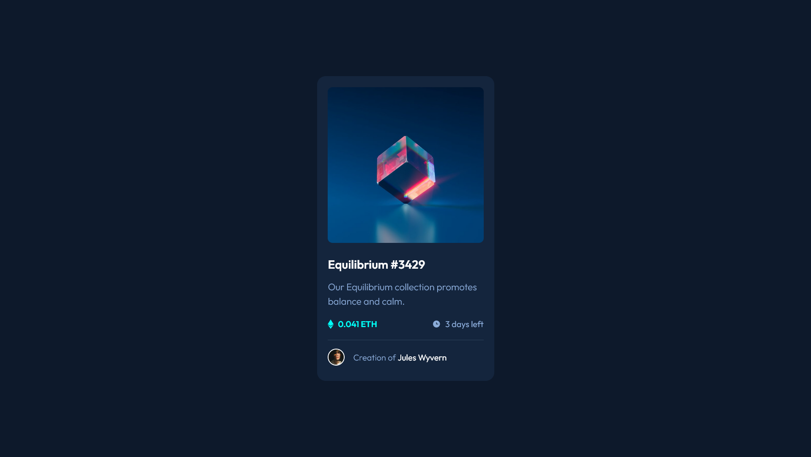

# Frontend Mentor - NFT Preview Card Component Solution

🚨 **I DO NOT SUPPORT NFTS** 🚨

Just in case anyone thought otherwise...

This is a solution to the [NFT Preview Card Component Challenge on Frontend Mentor](https://www.frontendmentor.io/challenges/nft-preview-card-component-SbdUL_w0U). Frontend Mentor challenges help you improve your coding skills by building realistic projects. 

## Table of contents

- [Overview](#overview)
  - [The challenge](#the-challenge)
  - [Screenshot](#screenshot)
  - [Links](#links)
- [My process](#my-process)
  - [Built with](#built-with)
  - [What I learned](#what-i-learned)
  - [Continued development](#continued-development)

## Overview

### The challenge

Users should be able to:

- View the optimal layout depending on their device's screen size
- See hover states for interactive elements

### Screenshot

### Links

- [Solution](https://github.com/VasJM/nft-preview-card-component)
- [Live Site](https://your-live-site-url.com)

## My process

### Built with

- Love 💖
- Semantic HTML5 markup
- CSS custom properties
- CSS Flex
- Mobile-first workflow

### What I learned

I love image overlays? I think they're just neat. 

My beloved `flex` got to shine in this project! While I didn't learn anything new this time around, I *have* noticed that I've gotten better at CSS-ing. My speed has also seen some improvement!

### Continued development

I want to get better at making cooler image overlays. I wonder what more I can do with them!